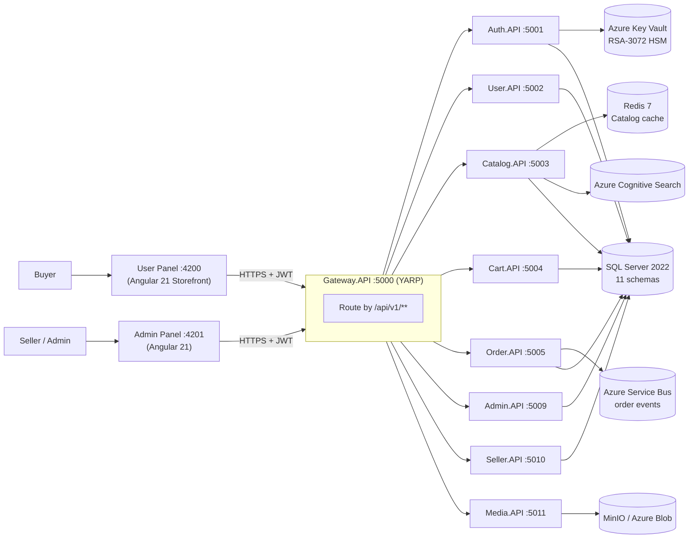

<div align="center">

# 🛍️ StyleNest

**Multi-category fashion & lifestyle marketplace, built cloud-native.**

A production-grade e-commerce platform for the Indian fashion market — storefront, seller portal, and admin console on one Azure-ready microservices backend.

[](user-panel)
[](backend)
[](docs/DATABASE_SCHEMA.md)
[](infra/bicep)

</div>

---

## ✨ Features

| Category | Details |
|---|---|
| 🛒 **Storefront** | PLP/PDP, cart, coupon-aware checkout, wishlist, save-for-later, order tracking stepper, return flow |
| 🔍 **Search & Discovery** | Azure Cognitive Search — full-text, BM25 ranking, facets, synonyms, autocomplete typeahead |
| 🔐 **Auth** | JWT RS256, OTP flow, Google / Facebook OAuth2, refresh-token rotation, TOTP MFA for admins |
| 🏪 **Seller Portal** | Product & inventory management, seller analytics, automated Razorpay payouts |
| 🛠️ **Admin Panel** | RBAC-guarded dashboards, ApexCharts KPIs, banner/coupon CMS, review moderation, audit log |
| 🤖 **AI** | Azure OpenAI product-description assistant, personalised product feed, related-product rails |
| 📣 **Notifications** | MSG91 WhatsApp order updates, email OTP (MailKit), in-app notification bell |
| ☁️ **Cloud-Native** | Bicep IaC, Key Vault HSM keys, Service Bus order events, geo-replicated SQL DR, blue-green deploy |
| 📱 **Responsive** | Mobile-first Tailwind layout, bottom nav on mobile, sticky filter sidebar on desktop |

> **V2 Enhancement Sprint complete** — all 91 ENH-IDs shipped across 14 domains. See [docs/FEATURE-ENHANCEMENTS.md](docs/FEATURE-ENHANCEMENTS.md).

---

## 🏗️ Architecture Overview

StyleNest is a set of independently deployable .NET microservices behind a YARP API gateway, each owning its own EF Core schema on a shared SQL Server instance, with two separate Angular 21 SPAs for the storefront and admin/seller experience.



### Key Design Decisions
- **Schema-per-service on one SQL Server** — each microservice owns its EF Core schema (`auth`, `catalog`, `commerce`, `orders`, `admin`, …); no cross-service joins.
- **YARP gateway as the single client-facing entry point** — all Angular traffic goes through Gateway.API; downstream services are never called directly by the browser.
- **JWT RS256, issued once, verified everywhere** — Auth.API holds the private key; every other service validates with the shared public key (or Key Vault HSM key in production).
- **Graceful degradation on V2/Azure services** — Redis, Cognitive Search, Service Bus, Key Vault and Azure OpenAI are optional locally; `REPLACE_` placeholders in `appsettings.json` trigger local/in-memory fallbacks.
- **Repository pattern throughout** — `IRepository<T>` → `EfRepository<T>`, DTOs for every API boundary, AutoMapper profiles, FluentValidation on every request DTO.

---

## 🛠️ Technology Stack

| Layer | Technologies Used |
|---|---|
| **Frontend** | Angular 21, NgRx 21 (store/effects/entity), Tailwind CSS 3, Angular Material 21, ApexCharts, RxJS 7 |
| **Backend** | .NET 10, ASP.NET Core Web API (9 microservices + YARP gateway), EF Core 9 |
| **Database** | SQL Server 2022 — 11 schemas, 30+ tables, Active Geo-Replication (Central India DR) |
| **Cache** | Redis 7 — catalog cache (10–60 min TTL), AAD Managed Identity auth on Azure Cache |
| **Search** | Azure Cognitive Search — full-text, BM25 ranking, facets, synonyms, autocomplete |
| **Auth** | JWT RS256, ASP.NET Core Identity, OTP flow, Google/Facebook OAuth2, Key Vault HSM RSA-3072 |
| **Messaging** | Azure Service Bus — session-enabled order event queue (FIFO, deduplication) |
| **AI** | Azure OpenAI — product description assistant, personalised product feed |
| **Notifications** | MSG91 WhatsApp API, email OTP (MailKit), in-app notification bell |
| **Payments** | Razorpay Payout API — automated seller payouts |
| **Storage** | MinIO / Azure Blob Storage via Media.API |
| **IaC** | Bicep — App Services, Key Vault (private endpoint), SQL TLS 1.3, Log Analytics, FinOps tags |
| **Testing** | xUnit + Moq + FluentAssertions (62 tests), Playwright E2E (3 journeys) |
| **CI/CD** | GitHub Actions — build, test, Docker push, Azure Container Apps deploy (blue-green + auto-rollback) |

---

## 📋 Prerequisites

| Tool | Version | Notes |
|---|---|---|
| [.NET SDK](https://dotnet.microsoft.com/download/dotnet/10.0) | 10.0+ | `dotnet --version` |
| [Node.js](https://nodejs.org/) | 22.12+ | Angular CLI 21 requires ≥ 22 — use `nvm install 22` if needed |
| [Docker Desktop](https://www.docker.com/products/docker-desktop) | Latest | Required for the Docker path |
| SQL Server 2022 | 2022 | Local install, or use the Docker SQL container |
| Angular CLI | 21+ | `npm install -g @angular/cli@21` |

---

## 🚀 Getting Started

### 1. Clone the repository

```bash
git clone https://github.com/prakashinfotech/style-nest.git
cd style-nest
```

### 2A. Run with Docker (recommended)

```bash
# Copy the env template and fill in values
cp .env.example .env
# Edit .env: set SQLSERVER_SA_PASSWORD and JWT key paths

# Start the full stack (SQL Server + Redis + MinIO + all APIs + Angular)
docker compose up --build
```

Open `http://localhost:4200` (User Panel) or `http://localhost:4201` (Admin Panel).

> EF Core migrations run automatically on first startup. JWT RS256 keys must be generated and referenced in `.env` (see [Environment Variables](#-environment-variables)). Redis and MinIO start automatically.

### 2B. Run without Docker

```bash
# Start SQL Server only, via Docker
docker compose up sqlserver -d

# Generate the RS256 key pair
openssl genrsa -out keys/private.pem 2048
openssl rsa -in keys/private.pem -pubout -out keys/public.pem
# Reference these paths under "Jwt" in each API's appsettings.Development.json

# Apply EF Core migrations (creates all schemas + seeds 100 products, admin user)
cd backend
dotnet ef database update \
  --project src/Shared/StyleNest.Infrastructure \
  --startup-project src/Services/StyleNest.Auth.API

# Run each API in its own terminal
dotnet run --project src/Services/StyleNest.Gateway.API   # :5000
dotnet run --project src/Services/StyleNest.Auth.API      # :5001
dotnet run --project src/Services/StyleNest.User.API      # :5002
dotnet run --project src/Services/StyleNest.Catalog.API   # :5003
dotnet run --project src/Services/StyleNest.Cart.API      # :5004
dotnet run --project src/Services/StyleNest.Order.API     # :5005
dotnet run --project src/Services/StyleNest.Admin.API     # :5009
dotnet run --project src/Services/StyleNest.Seller.API    # :5010
dotnet run --project src/Services/StyleNest.Media.API     # :5011
```

```bash
# User Storefront — new terminal
cd user-panel && npm install && npx ng serve --proxy-config proxy.conf.json   # :4200

# Admin Panel — new terminal
cd admin-panel && npm install && npx ng serve   # :4201
```

---

## 🔌 Service & Port Map

| Service | Port | Swagger UI (Dev only) |
|---|---|---|
| Gateway.API (YARP) | **5000** | — |
| Auth.API | **5001** | http://localhost:5001/swagger |
| User.API | **5002** | http://localhost:5002/swagger |
| Catalog.API | **5003** | http://localhost:5003/swagger |
| Cart.API | **5004** | http://localhost:5004/swagger |
| Order.API | **5005** | http://localhost:5005/swagger |
| Admin.API | **5009** | http://localhost:5009/swagger |
| Seller.API | **5010** | http://localhost:5010/swagger |
| Media.API | **5011** | http://localhost:5011/swagger |
| User Panel | **4200** | http://localhost:4200 |
| Admin Panel | **4201** | http://localhost:4201 |
| SQL Server | **1433** | — |
| Redis | **6379** | — |
| MinIO Console | **9001** | http://localhost:9001 |

All API routes are versioned under `/api/v1/`. Swagger UI is disabled when `ASPNETCORE_ENVIRONMENT=Production`. Every service exposes `GET /health`. `Notification.API` and `Payment.API` are scaffolded and reserved for a future phase.

---

## 👤 Default Accounts

Seeded automatically by `DbSeeder` on first startup. Password for every seeded account is `Test@123`.

| Role | Email | Notes |
|---|---|---|
| Super Admin | `superadmin@mailinator.com` | Full platform access; manages admins & sellers |
| Admin | `admin1@mailinator.com` / `admin2@mailinator.com` | CMS, products, orders, coupons, banners |
| Seller | `seller01@mailinator.com` … `seller20@mailinator.com` | 20 seeded seller accounts |
| Customer | `user01@mailinator.com` … `user15@mailinator.com` | 15 seeded customer accounts |

New user registration is enabled via `/register` on the storefront. Full account list: [docs/SEEDER.md](docs/SEEDER.md).

---

## 🧪 Testing

```bash
# .NET unit tests — 62 tests across 5 projects (Auth, Catalog, Cart, Order, Seller)
cd backend && dotnet test

# Angular type-check
cd user-panel && npx tsc --noEmit
cd admin-panel && npx tsc --noEmit

# Angular unit tests
cd user-panel && npx ng test --watch=false --code-coverage

# Playwright E2E — 3 journeys (customer, seller, admin); full stack must be running
cd e2e && npm install && npx playwright test
```

---

## 🔧 Environment Variables

Copy `.env.example` to `.env` and fill in the values. **Never commit `.env`.**

| Variable | Required | Description |
|---|---|---|
| `SQLSERVER_SA_PASSWORD` | Yes | SQL Server SA password |
| `ConnectionStrings__DefaultConnection` | Yes | Full EF Core connection string |
| `ConnectionStrings__Redis` | No | Redis connection string — omit to disable catalog caching |
| `Jwt__PrivateKeyPath` | Auth.API only | Path to RSA private key `.pem` |
| `Jwt__PublicKeyPath` | All APIs | Path to RSA public key `.pem` |
| `Jwt__Issuer` / `Jwt__Audience` | Yes | JWT claims |
| `AllowedOrigins__0` / `__1` | Prod | Allowed CORS origins |
| `MinIO__Endpoint` / `__AccessKey` / `__SecretKey` | No | Defaults to local MinIO container |

**V2 Azure services** (optional — leave at `REPLACE_` defaults locally; services fall back gracefully): `AzureCognitiveSearch__Endpoint/ApiKey`, `Jwt__KeyVaultUri/KeyVaultKeyName`, `ServiceBus__ConnectionString`, `Redis__UseManagedIdentity`, `AzureOpenAI__Endpoint/ApiKey`, `Msg91WhatsApp__AuthKey`, `RazorpayPayout__KeyId/KeySecret`.

Full reference: [docs/DEPLOYMENT.md](docs/DEPLOYMENT.md).

---

## 📁 Repository Directory Structure

```text
style-nest/
├── backend/
│   ├── src/
│   │   ├── Services/
│   │   │   ├── StyleNest.Gateway.API/        # YARP reverse proxy — routes all client traffic
│   │   │   ├── StyleNest.Auth.API/           # Register, login, refresh, logout, OTP, password reset
│   │   │   ├── StyleNest.User.API/           # Profile, addresses, wishlist, wallet, notifications
│   │   │   ├── StyleNest.Catalog.API/        # Products, categories, brands, attributes, Redis cache
│   │   │   ├── StyleNest.Cart.API/           # Cart CRUD, coupon apply, save-for-later
│   │   │   ├── StyleNest.Order.API/          # Place order, buy-now, history, cancel, tracking, returns
│   │   │   ├── StyleNest.Admin.API/          # Banners, coupons, admin orders/products/users, RBAC
│   │   │   ├── StyleNest.Seller.API/         # Seller products, inventory, analytics, payouts
│   │   │   ├── StyleNest.Media.API/          # Upload pipeline (MinIO / Azure Blob), MIME validation
│   │   │   ├── StyleNest.Notification.API/   # (scaffolded — reserved for a future phase)
│   │   │   └── StyleNest.Payment.API/        # (scaffolded — reserved for a future phase)
│   │   └── Shared/
│   │       ├── StyleNest.Infrastructure/     # EF Core DbContext, EfRepository<T>, migrations, seeders
│   │       └── StyleNest.SharedKernel/       # BaseEntity, Result<T>, IRepository<T>, middleware
│   └── tests/                                # xUnit — 62 tests across 5 projects
├── user-panel/                               # User-facing Angular 21 storefront
│   └── src/app/{core,store,features,layout,shared}/
├── admin-panel/                              # Admin / Seller Angular 21 panel
│   └── src/app/{core,store,features,layout,shared}/
├── shared-types/                             # TypeScript contracts shared across both Angular apps
├── e2e/tests/                                # Playwright E2E — 3 journey specs
├── infra/bicep/                              # App Service, Key Vault, SQL geo-replication modules
├── scripts/migration/                        # Schema migration validator + rollback generator
├── docs/                                     # ARCHITECTURE, API, DATABASE_SCHEMA, SECURITY, DEPLOYMENT, …
├── docker-compose.yml
├── .env.example
└── CLAUDE.md                                 # AI coding rules for this repo
```

---

## 📚 Documentation

| Doc | Purpose |
|---|---|
| [FEATURE_ROADMAP.md](FEATURE_ROADMAP.md) | Phase-by-phase task tracker |
| [docs/FEATURE-ENHANCEMENTS.md](docs/FEATURE-ENHANCEMENTS.md) | V2+ enhancement backlog — 91 ENH-IDs |
| [docs/ARCHITECTURE.md](docs/ARCHITECTURE.md) | System architecture, ADRs, sequence diagrams |
| [docs/API.md](docs/API.md) | Full endpoint reference (all controllers) |
| [docs/DATABASE_SCHEMA.md](docs/DATABASE_SCHEMA.md) | Complete SQL schema — all 11 schemas |
| [docs/ROLES_RBAC.md](docs/ROLES_RBAC.md) | Permission matrix, policy definitions, guard config |
| [docs/DESIGN.md](docs/DESIGN.md) | Design tokens, typography, breakpoints |
| [docs/DEPLOYMENT.md](docs/DEPLOYMENT.md) | Docker Compose, CI/CD, Azure production architecture |
| [docs/SECURITY.md](docs/SECURITY.md) | Threat model, auth security, RBAC implementation |
| [docs/PERFORMANCE.md](docs/PERFORMANCE.md) | Redis caching, query optimization, bundle analysis |
| [docs/SEEDER.md](docs/SEEDER.md) | All seeded accounts, categories, brands, products |
| [docs/DISASTER-RECOVERY.md](docs/DISASTER-RECOVERY.md) | DR runbook — RTO ≤ 1h, RPO ≤ 15 min |

---

## 🗺️ Project Status

**Phase 14 — Deployment & Final Validation** in progress (Azure staging deploy, E2E role validation, Lighthouse audit, OWASP checklist). Phases 1–13 and the V2 Enhancement Sprint (all 91 ENH-IDs across 14 domains) are complete — see [FEATURE_ROADMAP.md](FEATURE_ROADMAP.md) for the full phase-by-phase log.

## 🤝 Contributing

1. Fork the repository
2. Create a feature branch (`git checkout -b feat/<scope>`)
3. Commit using [Conventional Commits](CLAUDE.md#git-commit-convention-phase-8--mandatory) (`feat(catalog): add ...`)
4. Push and open a Pull Request

---

<div align="center">

**Built for the Indian fashion & lifestyle market**

</div>
