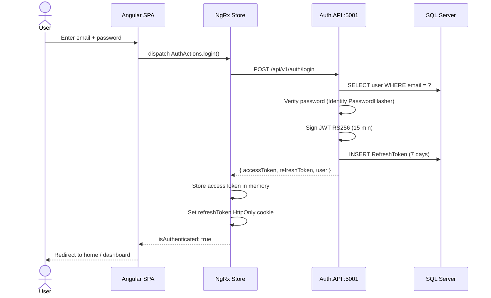
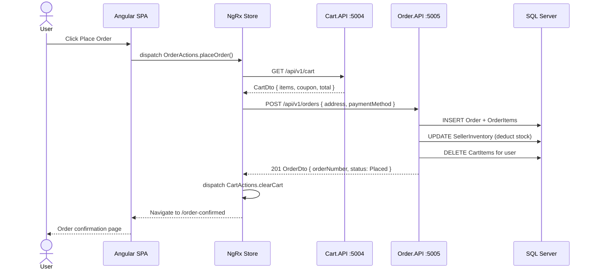
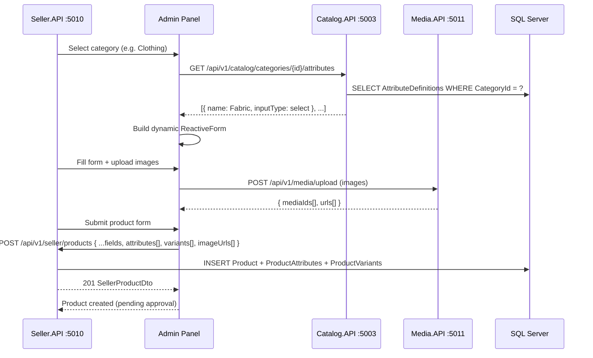

# ARCHITECTURE.md — Fashion eCommerce Platform
> Enterprise-grade system architecture for a multi-role fashion marketplace.
> Two separate Angular frontends · .NET 10 microservices · SQL Server 2022 · Docker.
> **This document is the single source of truth for system architecture decisions.**

---

## 1. Platform Overview

```
┌──────────────────────────────────────────────────────────────────────────────────┐
│                       FASHION ECOMMERCE PLATFORM                                 │
├───────────────────────────────┬──────────────────────────────────────────────────┤
│  ADMIN PANEL  (Port 4201)     │  USER STOREFRONT  (Port 4200)                    │
│  Angular 21 — Standalone      │  Angular 21 — Standalone                         │
│                               │                                                  │
│  ┌─────────────┐              │  ┌──────────────┐  ┌──────────────┐              │
│  │ Super Admin │              │  │   Customer   │  │    Guest     │              │
│  │   Admin     │              │  │  (auth flow) │  │  (browsing)  │              │
│  │   Seller    │              │  └──────────────┘  └──────────────┘              │
│  └─────────────┘              │                                                  │
└───────────────────────────────┴──────────────────────────────────────────────────┘
                  │                              │
                  ▼                              ▼
┌──────────────────────────────────────────────────────────────────────────────────┐
│              API GATEWAY — YARP Reverse Proxy  (Port 5000)                       │
│   Route → versioned microservices · JWT validation · Rate limiting · CORS        │
└──────────────────────────────────────────────────────────────────────────────────┘
      │          │         │          │         │          │         │         │
      ▼          ▼         ▼          ▼         ▼          ▼         ▼         ▼
  Auth.API   User.API  Catalog.API Cart.API Order.API Admin.API Seller.API Media.API
  :5001      :5002     :5003       :5004    :5005     :5009     :5010      :5011
      │          │         │          │         │          │         │         │
      └──────────┴─────────┴──────────┴─────────┴──────────┴─────────┴─────────┘
                                       │
                         ┌─────────────┴──────────────┐
                         │       SQL Server 2022        │
                         │  Schemas:                    │
                         │  auth · catalog · commerce   │
                         │  orders · admin · seller     │
                         │  media · analytics · wallet  │
                         │  notifications               │
                         └──────────────────────────────┘
```

---

## 2. Architectural Decision Record (ADR)

### ADR-001: Separate Admin Panel vs Single SPA

**Decision:** Two separate Angular projects (admin-panel + user-storefront).

| Concern | Single SPA (rejected) | Separate Panel (chosen) |
|---|---|---|
| Bundle size | Admin code shipped to customers | Completely isolated |
| Security surface | Admin routes exposed in customer JS | Zero exposure |
| Deploy cadence | Must coordinate deploys | Independent deploys |
| Auth context | Shared store (higher risk) | Separate session contexts |
| Role guard complexity | Guards must handle all 4 roles | Role is implicit from app |

### ADR-002: Shared API Layer

Both Angular projects call the **same backend microservices** through the YARP gateway. No API duplication. Authorization is enforced server-side; frontend guards are UX-only, never the security boundary.

### ADR-003: Shared SQL Server — Schema Isolation

Single SQL Server with per-domain schemas (`[auth]`, `[catalog]`, `[commerce]`, `[orders]`, `[admin]`, `[seller]`, `[media]`, `[analytics]`, `[wallet]`, `[notifications]`) gives schema isolation without database-per-service operational complexity. Migration to per-service databases is feasible in Phase 15+ by splitting the shared DbContext.

### ADR-004: JWT RS256 Authentication

RS256 uses asymmetric keys: only Auth.API holds the private key (for signing); all other services hold only the public key (for verification). A compromised Catalog.API cannot forge tokens. HS256 (symmetric) is rejected because every verifying service would also be able to forge tokens.

### ADR-005: YARP as API Gateway

YARP (Yet Another Reverse Proxy) is a first-class .NET library, maintaining the .NET-only stack. It handles routing, JWT pre-validation, rate limiting, and CORS — replacing Nginx/Kong for the development and staging tiers.

### ADR-006: EAV for Dynamic Product Attributes

Entity-Attribute-Value (EAV) pattern via `AttributeDefinitions` + `CategoryAttributes` + `ProductAttributes` tables enables dynamic fashion-specific attributes (Fabric, Fit, Heel Type, etc.) without schema migrations when new attribute types are added. See [DATABASE_SCHEMA.md](DATABASE_SCHEMA.md) for the full schema.

### ADR-007: MinIO → Azure Blob for Media Storage

MinIO (Docker, S3-compatible) is used in development. In production, swap the `IStorageService` implementation for Azure Blob Storage. No other code changes required. See [MEDIA_UPLOAD.md](MEDIA_UPLOAD.md).

### ADR-008: Monorepo Structure

Single git repository with `admin-panel/`, `user-storefront/`, `backend/`, `shared-types/`, `docs/`, and `infra/` top-level directories. Rationale: shared git history, shared TypeScript types without npm publishing, single CI pipeline, no dependency version drift.

### ADR-009: Redis Caching Strategy (Phase 13)

Redis 7 is used as a distributed cache for the Catalog.API to reduce SQL Server load on high-traffic read paths:

| Cache Key Pattern | TTL | Invalidated When |
|---|---|---|
| `catalog:products:<hash>` | 10 minutes | Product created / updated |
| `catalog:categories` | 60 minutes | Category created |
| `catalog:brands` | 60 minutes | Brand created |

`ICacheService` wraps `IDistributedCache` with JSON serialization. When Redis is unavailable (no `ConnectionStrings:Redis` configured), `NullCacheService` is substituted — the application continues without caching, ensuring Redis is not a hard dependency in development environments without Docker.

### ADR-010: Production Security Hardening (Phase 13)

All APIs enforce:
1. **Security headers** — `SecurityHeadersMiddleware` (SharedKernel) appends `X-Content-Type-Options`, `X-Frame-Options`, `X-XSS-Protection`, `Referrer-Policy`, `Permissions-Policy`, `Content-Security-Policy` on every response.
2. **Swagger gated by environment** — `app.MapOpenApi()` and `app.UseSwaggerUI()` only run when `ASPNETCORE_ENVIRONMENT != Production`.
3. **Configurable CORS** — `AllowedOrigins` read from `appsettings.json` / environment variables; falls back to localhost dev origins only. Production must set `AllowedOrigins` to actual domain(s).
4. **Response compression** — Brotli (primary) + Gzip (fallback) on all API responses, including HTTPS.
5. **Health checks** — `GET /health` on every service returns JSON with SQL Server connectivity status. Gateway `/health` aggregates all downstream checks.

---

## 3. Service Inventory

| Service | Port | Language | Responsibility | Auth Required |
|---|---|---|---|---|
| **Gateway.API** | 5000 | .NET 10 | YARP routing, rate limiting, CORS | — |
| **Auth.API** | 5001 | .NET 10 | Register, login, refresh, logout, OTP | Mixed |
| **User.API** | 5002 | .NET 10 | Profile, addresses, wishlist, wallet, notifications | All |
| **Catalog.API** | 5003 | .NET 10 | Products, categories, brands, attributes, reviews, search | GET = public |
| **Cart.API** | 5004 | .NET 10 | Cart CRUD, coupon apply, save-for-later | All |
| **Order.API** | 5005 | .NET 10 | Order lifecycle, tracking, cancellation, returns | All |
| **Admin.API** | 5009 | .NET 10 | Super admin + admin operations, CMS, analytics | Admin/SuperAdmin |
| **Seller.API** | 5010 | .NET 10 | Seller dashboard, product mgmt, inventory, payouts | Seller |
| **Media.API** | 5011 | .NET 10 | File upload, resize, video thumbnail | Seller/Admin |
| **SQL Server** | 1433 | SQL Server 2022 | Primary database | — |
| **Redis** | 6379 | Redis 7 | Cache + session store | — |
| **MinIO** | 9000 | MinIO | Object storage (dev) | — |
| **Seq** | 5341 | Seq | Structured log viewer (dev only) | — |
| **User Storefront** | 4200 | Angular 21 | Customer-facing eCommerce SPA | — |
| **Admin Panel** | 4201 | Angular 21 | Admin + Seller management SPA | — |

---

## 4. Clean Architecture per Microservice

Every .NET service follows identical internal layering:

```
StyleNest.<Name>.API/
├── Controllers/
│   └── V1/                     ← Versioned controllers (one per resource)
├── Services/
│   ├── I<Name>Service.cs       ← Interface
│   └── <Name>Service.cs        ← Implementation
├── Repositories/
│   ├── I<Name>Repository.cs    ← Interface (extends IRepository<T>)
│   └── <Name>Repository.cs     ← EF Core implementation
├── DTOs/
│   ├── Requests/               ← Input DTOs
│   └── Responses/              ← Output DTOs
├── Validators/                 ← FluentValidation (one per request DTO)
├── Mapping/                    ← AutoMapper profiles (Entity ↔ DTO)
├── Events/                     ← Domain events (Hangfire / SignalR triggers)
├── Extensions/                 ← IServiceCollection extension methods
├── Middleware/                 ← Service-specific middleware
├── Program.cs                  ← Minimal API bootstrap + DI
├── appsettings.json
├── appsettings.Development.json
└── Dockerfile
```

**Dependency direction:** Controllers → Services → Repositories → DbContext.
Services never depend on Controllers. Repositories never depend on Services.

---

## 5. Shared Projects

```
Shared/
├── StyleNest.SharedKernel/
│   ├── Entities/
│   │   └── BaseEntity.cs           ← Id (Guid), CreatedAt, UpdatedAt, IsDeleted
│   ├── Results/
│   │   ├── Result<T>.cs            ← Railway-oriented error handling
│   │   └── Error.cs
│   ├── Interfaces/
│   │   └── IRepository<T>.cs       ← Generic repository contract
│   ├── Pagination/
│   │   └── PagedResult<T>.cs       ← Paginated response wrapper
│   └── Middleware/
│       ├── GlobalExceptionMiddleware.cs  ← RFC 7807 ProblemDetails
│       └── CorrelationIdMiddleware.cs    ← X-Correlation-Id header
│
└── StyleNest.Infrastructure/
    ├── AppDbContext.cs             ← Single DbContext, all schemas
    ├── EfRepository<T>.cs          ← Generic EF Core implementation
    ├── Interceptors/
    │   └── AuditInterceptor.cs     ← Auto-set CreatedAt/UpdatedAt
    ├── Migrations/                 ← All EF Core migrations
    └── Seeders/
        ├── DbSeeder.cs             ← Orchestrator
        ├── RoleSeeder.cs
        ├── SuperAdminSeeder.cs
        ├── AdminSeeder.cs
        ├── SellerSeeder.cs
        ├── UserSeeder.cs
        ├── CategorySeeder.cs
        ├── BrandSeeder.cs
        ├── AttributeSeeder.cs
        ├── ProductSeeder.cs
        ├── BannerSeeder.cs
        └── CouponSeeder.cs
```

---

## 6. Frontend Architecture

### User Storefront (Port 4200)

```
user-storefront/src/app/
├── core/
│   ├── guards/              ← auth.guard, role.guard, guest.guard
│   ├── interceptors/        ← auth.interceptor, error.interceptor, loading.interceptor
│   ├── services/            ← One service per API domain
│   └── models/              ← TypeScript interfaces (Product, Order, User, etc.)
├── store/                   ← NgRx
│   ├── auth/
│   ├── cart/
│   ├── catalog/
│   ├── order/
│   ├── wishlist/
│   └── ui/
├── features/                ← Lazy-loaded pages
│   ├── home/
│   ├── catalog/             ← PLP (product listing) + PDP (product detail)
│   ├── cart/
│   ├── checkout/
│   ├── orders/              ← Order history + detail + tracking
│   ├── account/             ← Profile, addresses, wallet
│   ├── auth/                ← Login, register, forgot-password, OTP
│   ├── wishlist/
│   └── search/
├── layout/
│   ├── header/
│   ├── footer/
│   ├── bottom-nav/          ← Mobile only
│   └── mega-menu/
└── shared/
    ├── components/          ← product-card, empty-state, skeleton, toast
    ├── pipes/               ← currency-inr, truncate, time-ago
    └── directives/          ← infinite-scroll, lazy-image, click-outside
```

### Admin Panel (Port 4201)

```
admin-panel/src/app/
├── core/
│   ├── guards/              ← super-admin.guard, admin.guard, seller.guard
│   ├── interceptors/
│   ├── services/            ← admin.service, seller.service, analytics.service
│   └── models/
├── store/
│   ├── auth/
│   ├── analytics/
│   ├── products/
│   ├── orders/
│   └── ui/
├── features/
│   ├── auth/                ← Admin login page (separate from storefront)
│   ├── super-admin/         ← Guarded: SuperAdmin role only
│   │   ├── dashboard/
│   │   ├── admins/
│   │   ├── sellers/
│   │   ├── users/
│   │   ├── rbac/
│   │   ├── platform-settings/
│   │   └── audit-logs/
│   ├── admin/               ← Guarded: Admin role + above
│   │   ├── dashboard/
│   │   ├── products/
│   │   ├── categories/
│   │   ├── brands/
│   │   ├── orders/
│   │   ├── banners/
│   │   ├── coupons/
│   │   ├── users/
│   │   └── reviews/
│   └── seller/              ← Guarded: Seller role (own data only)
│       ├── dashboard/
│       ├── products/        ← Dynamic attribute product form
│       ├── inventory/
│       ├── orders/
│       └── analytics/
├── layout/
│   ├── sidebar/             ← Role-aware navigation tree
│   ├── topbar/
│   └── breadcrumb/
└── shared/
    ├── components/          ← DataTable, ConfirmDialog, FileUpload, Charts
    ├── pipes/
    └── directives/
```

---

## 7. Routing Map

### User Storefront Routes

```
/                        → features/home (lazy)
/search                  → features/catalog/plp (lazy)  [?q&category&brand&price&sort&page]
/products/:id            → features/catalog/pdp (lazy)
/cart                    → features/cart (lazy)
/checkout                → features/checkout (lazy)         [auth guard]
/orders                  → features/orders/list (lazy)      [auth guard]
/orders/:id              → features/orders/detail (lazy)    [auth guard]
/account                 → features/account (lazy)          [auth guard]
/wishlist                → features/wishlist (lazy)         [auth guard]
/login                   → features/auth/login (lazy)
/register                → features/auth/register (lazy)
/forgot-password         → features/auth/forgot-password (lazy)
/verify-otp              → features/auth/verify-otp (lazy)
```

### Admin Panel Routes

```
/login                   → features/auth/login (no auth)
/super-admin             → features/super-admin/dashboard  [super-admin guard]
/super-admin/admins      → features/super-admin/admins
/super-admin/sellers     → features/super-admin/sellers
/super-admin/users       → features/super-admin/users
/super-admin/rbac        → features/super-admin/rbac
/super-admin/settings    → features/super-admin/platform-settings
/super-admin/audit-logs  → features/super-admin/audit-logs
/admin                   → features/admin/dashboard        [admin guard]
/admin/products          → features/admin/products
/admin/categories        → features/admin/categories
/admin/orders            → features/admin/orders
/admin/banners           → features/admin/banners
/admin/coupons           → features/admin/coupons
/admin/users             → features/admin/users
/admin/reviews           → features/admin/reviews
/seller                  → features/seller/dashboard        [seller guard]
/seller/products         → features/seller/products
/seller/products/new     → features/seller/products/new     ← dynamic attribute form
/seller/inventory        → features/seller/inventory
/seller/orders           → features/seller/orders
/seller/analytics        → features/seller/analytics
```

---

## 8. NgRx State Shape

### User Storefront

```typescript
AppState {
  auth: {
    user: User | null
    accessToken: string | null   // memory only — NEVER localStorage
    isLoading: boolean
    error: string | null
  }
  cart: {
    items: CartItem[]
    coupon: Coupon | null
    isLoading: boolean
    error: string | null
  }
  catalog: {
    products: Product[]
    selectedProduct: Product | null
    productCache: Record<string, Product>
    relatedProducts: Product[]
    recentlyViewed: Product[]
    reviews: Review[]
    reviewsPage: number
    hasMoreReviews: boolean
    totalCount: number
    filters: FilterState
    sortBy: SortOption
    isLoadingProducts: boolean
    isLoadingProduct: boolean
    pdpError: string | null
    error: string | null
  }
  wishlist: {
    productIds: string[]
    isLoading: boolean
  }
  order: {
    orders: Order[]
    currentOrder: Order | null
    isLoading: boolean
    error: string | null
  }
  ui: {
    isGlobalLoading: boolean
    toast: ToastState | null
    sidenavOpen: boolean
  }
}
```

### Admin Panel

```typescript
AdminAppState {
  auth: AuthState               // same shape, different role context
  analytics: {
    dailyRevenue: DailyRevenue[]
    topProducts: ProductMetric[]
    topSellers: SellerMetric[]
    orderStats: OrderStats
    userStats: UserStats
    dateRange: DateRange
    isLoading: boolean
  }
  products: {
    items: AdminProduct[]
    pendingApproval: AdminProduct[]
    totalCount: number
    isLoading: boolean
  }
  orders: {
    items: AdminOrder[]
    totalCount: number
    filters: OrderFilterState
    isLoading: boolean
  }
  users: {
    customers: AdminUser[]
    admins: AdminUser[]
    sellers: Seller[]
    isLoading: boolean
  }
  ui: UiState
}
```

---

## 9. Authentication Flow

```
Login Request
     │
     ▼
Auth.API validates credentials (ASP.NET Core Identity)
     │
     ├── Load user roles from DB
     ├── Build JWT claims:
     │   ├── sub: userId (GUID)
     │   ├── email: user@email.com
     │   ├── role: ["SuperAdmin"] | ["Admin"] | ["Seller"] | ["User"]
     │   ├── sellerId: GUID (if Seller role — for ownership validation)
     │   ├── jti: unique token ID (for blacklisting on logout)
     │   └── exp: now + 15 minutes
     ├── Sign with RS256 private key (Auth.API only)
     ├── Generate opaque RefreshToken (GUID, 7-day expiry, stored in DB)
     └── Return: { accessToken, refreshToken, user }

Client Storage:
  accessToken  → NgRx memory only (lost on hard refresh — by design)
  refreshToken → HttpOnly cookie (XSS-safe, SameSite=Strict)

On 401 → error interceptor dispatches refresh:
  POST /api/v1/auth/refresh
    → validate refreshToken from HttpOnly cookie
    → issue new accessToken + rotated refreshToken
    → retry original request
  On refresh failure → logout + redirect to /login

On logout:
  POST /api/v1/auth/logout
    → revoke refreshToken in DB (IsRevoked = true)
    → add jti to Redis blacklist (TTL = remaining token expiry)
```

---

## 10. Authorization Architecture

See [ROLES_RBAC.md](ROLES_RBAC.md) for the full permission matrix.

```csharp
// Policies registered per API
options.AddPolicy("SuperAdminOnly",    p => p.RequireRole("SuperAdmin"));
options.AddPolicy("AdminOrAbove",      p => p.RequireRole("SuperAdmin", "Admin"));
options.AddPolicy("SellerOrAbove",     p => p.RequireRole("SuperAdmin", "Admin", "Seller"));
options.AddPolicy("AuthenticatedUser", p => p.RequireAuthenticatedUser());
options.AddPolicy("OwnSellerData",     p => p.AddRequirements(new SellerOwnershipRequirement()));
```

---

## 11. API Standards

All routes prefixed: `/api/v1/`

### Pagination Response Shape

```json
{
  "data": [...],
  "pagination": {
    "page": 1,
    "pageSize": 24,
    "totalCount": 256,
    "totalPages": 11,
    "hasNext": true,
    "hasPrevious": false
  }
}
```

### Error Response (RFC 7807 ProblemDetails)

```json
{
  "type": "https://tools.ietf.org/html/rfc7807",
  "title": "Validation Failed",
  "status": 422,
  "detail": "One or more fields are invalid",
  "instance": "/api/v1/products",
  "traceId": "00-abc123-def456-00",
  "errors": {
    "title": ["Title is required"],
    "price": ["Price must be greater than 0"]
  }
}
```

---

## 12. Sequence Diagrams

### Login Flow



### Place Order Flow



### Seller Product Create Flow (Dynamic Attributes)



---

## 13. Infrastructure Diagram (Docker Compose)

```
docker-compose.yml
├── sqlserver    :1433  ← SQL Server 2022 with all schemas
├── redis        :6379  ← Cache + token blacklist
├── minio        :9000  ← Object storage (dev)
├── minio-ui     :9001  ← MinIO console
├── seq          :5341  ← Structured log viewer
│
├── gateway      :5000  ← YARP gateway
├── auth-api     :5001
├── user-api     :5002
├── catalog-api  :5003
├── cart-api     :5004
├── order-api    :5005
├── admin-api    :5009
├── seller-api   :5010
├── media-api    :5011
│
├── storefront   :4200  ← Angular user app
└── admin-panel  :4201  ← Angular admin app
```

---

## 14. Naming Conventions

### C# / .NET

| Element | Convention | Example |
|---|---|---|
| Classes | PascalCase | `ProductService` |
| Interfaces | `IPascalCase` | `IProductService` |
| Methods | PascalCase | `GetProductAsync` |
| Private fields | `_camelCase` | `_repository` |
| DTOs | `<Resource>RequestDto` / `<Resource>ResponseDto` | `CreateProductRequestDto` |
| Controllers | `<Resource>Controller` | `ProductsController` |
| Migrations | `Phase<N>_<Context>_<Change>` | `Phase9_Catalog_AddReviews` |

### Angular / TypeScript

| Element | Convention | Example |
|---|---|---|
| Components | `kebab-case.component.ts` | `product-card.component.ts` |
| Services | `kebab-case.service.ts` | `catalog.service.ts` |
| Guards | `kebab-case.guard.ts` | `auth.guard.ts` |
| NgRx actions | `[Feature] Action Name` | `[Catalog] Load Products` |
| Interfaces | PascalCase | `Product`, `CartItem` |
| No `any` | Always type explicitly | `Product[]` not `any[]` |

### Database

| Element | Convention | Example |
|---|---|---|
| Tables | PascalCase singular | `Product`, `OrderItem` |
| Columns | PascalCase | `CreatedAt`, `SellerId` |
| Indexes | `IX_<Table>_<Column>` | `IX_Products_CategoryId` |
| Foreign keys | `FK_<Child>_<Parent>_<Col>` | `FK_Products_Categories_CategoryId` |

---

## 15. Cross-Cutting Concerns

| Concern | Implementation |
|---|---|
| Logging | Serilog → Console + Seq (dev) / Azure App Insights (prod) |
| Correlation IDs | `CorrelationIdMiddleware` adds `X-Correlation-Id` to every request/response |
| Error handling | `GlobalExceptionMiddleware` returns RFC 7807 ProblemDetails |
| Validation | FluentValidation on every request DTO, wired via `AddFluentValidationAutoValidation()` |
| Mapping | AutoMapper profile per service, never expose entities directly |
| Health checks | `GET /health` on every service |
| Caching | Redis via `IDistributedCache` on catalog + admin read paths |
| Background jobs | Hangfire Server in Admin.API (or dedicated Worker service) |
| Realtime | SignalR hub for order status tracking |

---

*This document is updated after every phase completion. Last updated: Phase 8 complete, Phase 9 (Enterprise Redesign) planning.*

*See also:*
- *[TECH_STACK.md](TECH_STACK.md) — Complete technology decisions*
- *[DATABASE_SCHEMA.md](DATABASE_SCHEMA.md) — Full schema reference*
- *[ROLES_RBAC.md](ROLES_RBAC.md) — Permission matrix*
- *[FRONTEND_ARCHITECTURE.md](FRONTEND_ARCHITECTURE.md) — Angular project internals*
- *[BACKEND_ARCHITECTURE.md](BACKEND_ARCHITECTURE.md) — .NET service internals*
- *[DEPLOYMENT.md](DEPLOYMENT.md) — Docker, CI/CD, and Azure*
- *[SECURITY.md](SECURITY.md) — Security architecture*
- *[PERFORMANCE.md](PERFORMANCE.md) — Caching and optimization*
- *[MEDIA_UPLOAD.md](MEDIA_UPLOAD.md) — File upload pipeline*
- *[SEEDER.md](SEEDER.md) — Database seed data*
- *[API.md](API.md) — Full endpoint reference*
